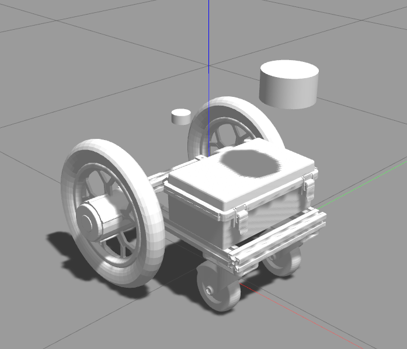
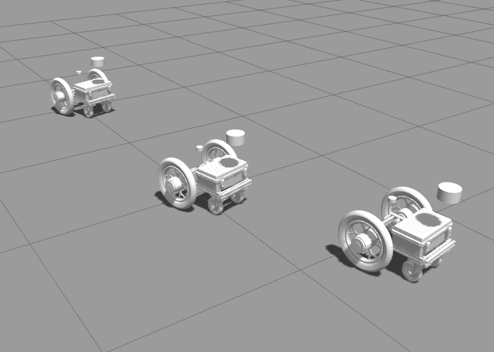

# ATCart Basic Gazebo model

This is a basic frame of ATCart system, if you don't know what is ATCart, please check on the Gitub repo below and the video

[Original Arduino project of ATCart](https://github.com/rasheeddo/BrushlessDriveWheels).

[Video](https://youtu.be/Y4HL69gDDOU).

## Dependencies

Basically in gazebo-ros world, the robot is using `cmd_vel` topic as the command to drive the cart. On the actual ATCart we are using a topic call `sbus_cmd` which is an array of [sbus_steering, sbus_throttle]. The sbus value is in the range of 368 to 1680 and middle is 1024. Because we cannot control the actual speed of the wheel, so approximately using the range of sbus to min/max of what the wheel can turn.

To do so, please check on the `jmoab-ros` [repo](https://github.com/rasheeddo/jmoab-ros#jmoab-with-atcart-wheels) for more information.

```sh
# on your ~/catkin_ws/src directory
# clone jmoab-ros, there is a simulation node which we can use

git clone https://github.com/rasheeddo/jmoab-ros.git 

# clone jmoab_autopilot_ros, there are useful automous-driving program to use with jmoab-ros and AT

git clone https://github.com/rasheeddo/jmoab_autopilot_ros.git


sudo apt-get install ros-$ROS_DISTRO-joy
```

## Run

### Single robot




```sh
# 1st terminal, to spawn gazebo model and other plugin such as laserscan, imu, gps
roslaunch atcart_basic_gazebo gazebo.launch

# 2nd terminal, to simulate atcart system with gazebo model, 
# you will get /sbus_cmd to drive the cart similar to actual cart
# you will get /atcart_mode to know the cart's mode, and controllable by /atcart_mode_cmd 
rosrun jmoab-ros jmoab-ros-atcart-siimulation.py

# 3rd terminal, to simulate gamepad control similar to RC transmitter of actual cart
rosrun joy joy_node

# 4th terminal, to convert the /imu topic and simulate it as compass as /jmoab_compass
# after run this, you will need to calibrate the heading, by moving the cart forward by gamepad
rosrun jmoab-ros jmoab-ros-compass-simulation.py

# 5th terminal, optional if you would like to see the bot GPS location on map
# you will need to have apmplanner2 install
# please check on this explanation link https://github.com/rasheeddo/jmoab-ros/blob/master/example/gcs.md 
cd ~/catkin_ws/src/jmoab-ros/example

python apm_planner_visualize.py --ip localhost --id 1
````

### Multi robots




```sh
# 1st terminal, this will spawn the robots from robots.launch, right now there are three bots
# if you need more bots, just copy the group from previous bot and paste after that
# and change the ns, namespace, tf_prefix, to new name, and init_pose to somewhere else
# it will start jmoab-ros-atcart-simulation and jmoab-ros-compass-simulation automatically according to each namespace
roslaunch atcart_basic_gazebo  swarm_bots.launch

# 2nd terminal, to control each bot
# if you have only one gamepad, you have to change ns to other robot's name in order to control it.
# if you have multiple gamepad, you can launch this on another terminal and change dev and ns .
# similar with the single bot, you will need to calibrate the heading by moving the bot forward by gamepad
roslaunch atcart_basic_gazebo joy dev:=/dev/input/js0 ns:=robot1

# 3rd, 4th, 5th terminals, visualize gps location of each bot on apmplanner2
# you will need to open apmplanner2 first, 
# and setup TCP connection with the port of 5760, 5860, 5960 and check on `As Server`

cd ~/catkin_ws/src/jmoab-ros/example

python apm_planner_visualize_tcp.py --ip localhost --id 1 --ns robot1

python apm_planner_visualize_tcp.py --ip localhost --id 2 --ns robot2

python apm_planner_visualize_tcp.py --ip localhost --id 3 --ns robot3


````